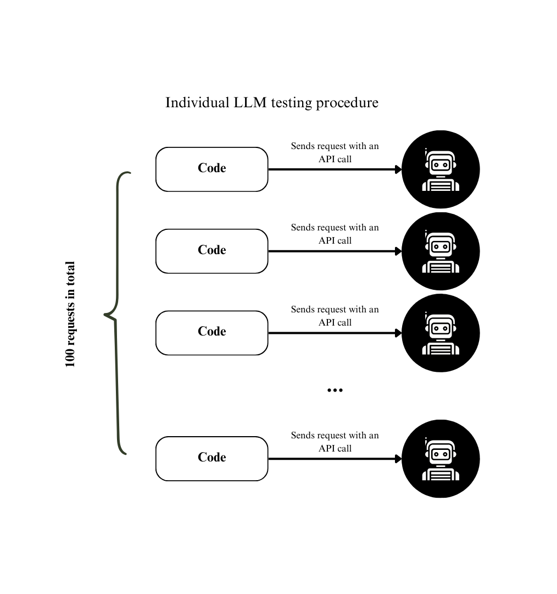

# When AIs Change Their Minds: Testing LLM Robustness to Altered Voting Protocols


### Abstract:

Large-language-model (LLM) agents are highly assigned collective decision-making tasks; nevertheless, there is limited understanding of their proneness to influence when the voting mechanism or social context is altered. We study this vulnerability with two types of simulation experiments made on the current 10 different popular LLMs (10 agents per model). In the first stage, the stand-alone LLM approach stage, we test each LLM individually within an isolated voting environment where each model receives a topic prompt and responds with a one-word verdict: agree or disagree. Per-model agreement rates establish reference distributions. In the second type of experiment, we studied the degree-dependent influence of the network by creating a random network of 100 agents with mixed LLMs as their background. Agents are fed with their neighbours’ opinions and then perform the voting procedure. The goal is to examine how an increase in the network degree affects opinion formation in agents. We record per-agent vote-flip rates, group-level entropy, and Kullback-Leibler divergence from the baseline. The research presents the initial comprehensive proof that modifications to voting methods or network degree may significantly influence LLM-mediated collective decisions.


### Keywords:
Large Language Models, Voting Protocol, Social Influence, Opinion Dynamics, Multi-Agent Simulation

## Introduction

Our work questions: How robust are LLM agents’ votes to (i) protocol alterations and (ii) network-degree-driven peer influence? By combining controlled isolated-agent baselines with networked simulations involving 100 mixed-LLM agents, we present the quantitative “vulnerability map” across the current ten mainstream models.

### Formal Problem Statement

We have an *M* set of heterogeneous LLMs and a *P* family of voting protocols that differ in the prompt structure and network degree *d∈{0, 9}*. Quantify or state for each model *m∈M*: 

1.	The baseline number of “agree” votes in isolation;
2.	The probability of a vote change when there is a switch from one protocol *p<sub>i</sub>* to *p<sub>j</sub> (i!=j)*;
3.	The aggregate change in group decision as a function of *d*.


## 🧪 Methodology

The experiments are divided into two parts: **Individual LLM Testing** and **Networked LLM Testing**.

Let *P* be the set of voting protocols (p<sub>0</sub> is the baseline protocol) and *M* the set of LLM models.

Each model *m<sub>i</sub>* was tested on each protocol *p<sub>i</sub>* in the Individual LLM Testing.  
A network of 100 agents was constructed from models in *M* and tested using protocol *p<sub>0</sub>*.

---

### Overall Experimental Pipeline

### Individual LLM Testing

For each model *m<sub>i</sub>*, the procedure:

1. Choose a voting protocol *p<sub>i</sub>* from family *P*.
2. Send **100 prompts** to *m<sub>i</sub>* using *p<sub>i</sub>*.
3. Record responses ("agree" or "disagree").
4. Statistically compare the **agree** counts between *p<sub>i</sub>* and *p<sub>0</sub>*.

**Experimental flow diagram:**  


*Figure 1. Individual LLM Testing General Procedure.*


**Sample Size Justification:**  
Each model’s opinion was estimated from **100 responses** per protocol.

For binary outcomes (agree/disagree), the **standard error (SE)** is maximized when *p = 0.5*:

```math
SE = sqrt( p * (1 - p) / n ) = sqrt( 0.5 * 0.5 / 100 ) = 0.05

